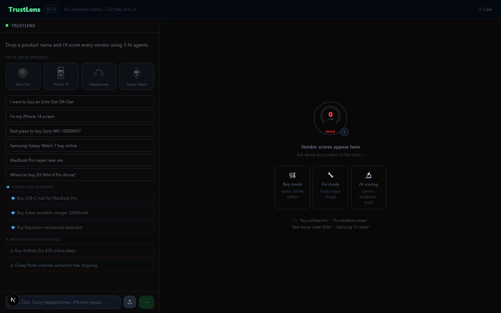
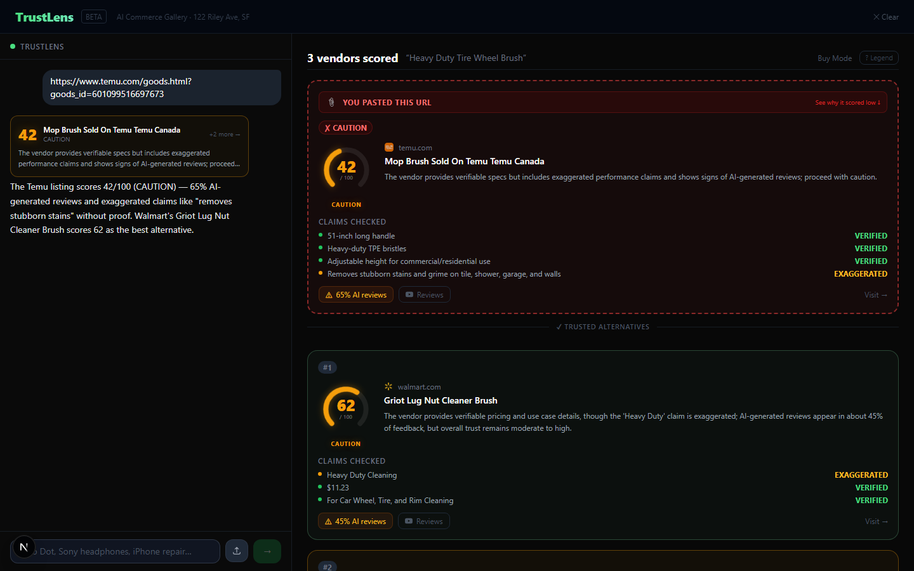
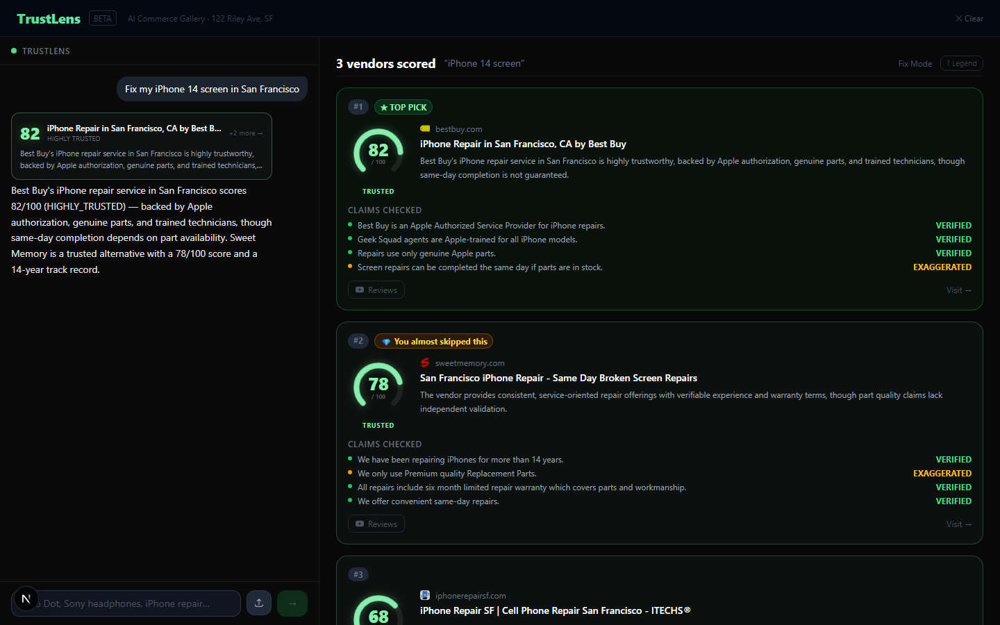
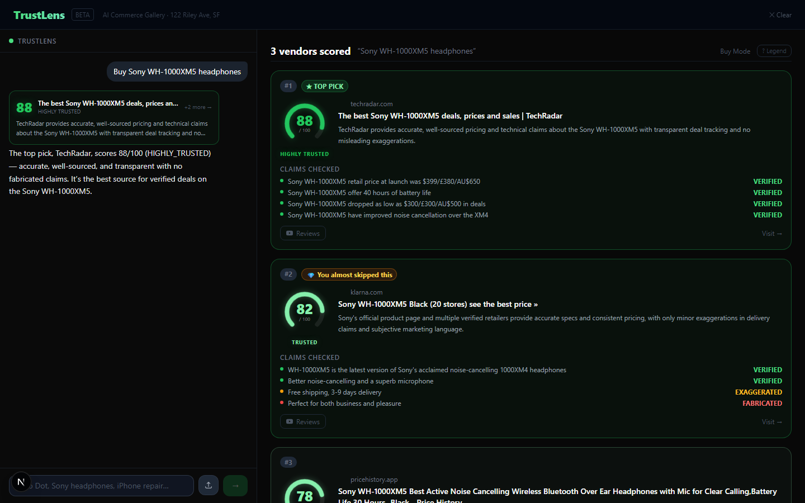
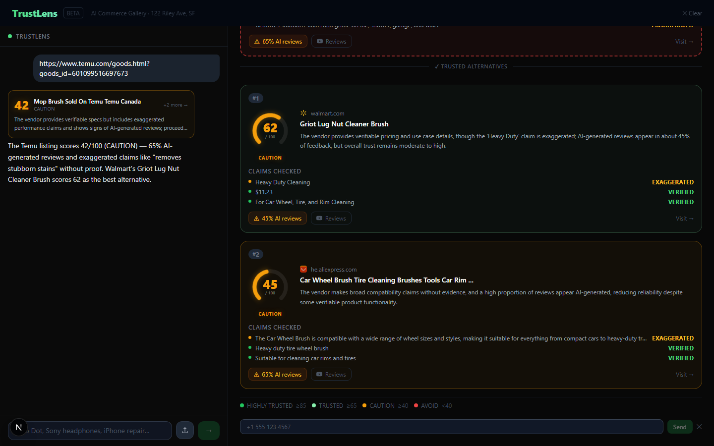
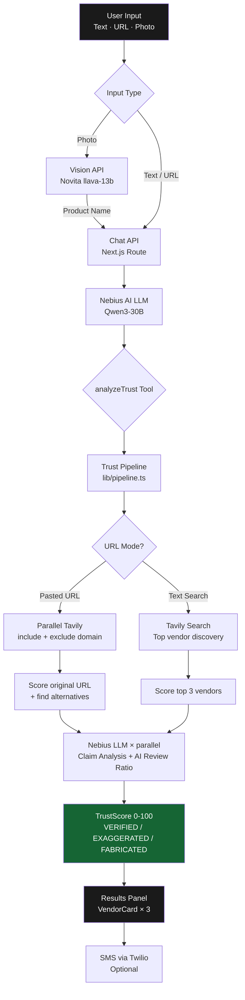

# TrustLens

**Stop trusting the top result. Start trusting the right one.**

TrustLens is an AI-powered shopping assistant that scores every vendor's *trustworthiness* — not their price or search ranking. It reads product claims, checks them against real evidence, detects AI-generated fake reviews, and gives you a single honest score before you buy.

Built for the **AI Commerce Gallery Hackathon · San Francisco · October 2026**

---

## Screenshots

| Home | Buy Results | Temu URL Mode |
|---|---|---|
|  |  |  |

| Fix Mode | Hidden Gem | SMS |
|---|---|---|
|  |  |  |

---

## The Problem

| What Google/Amazon shows you | What TrustLens shows you |
|---|---|
| Vendors who paid for top placement | Vendors ranked by verified trustworthiness |
| Star ratings that include fake reviews | AI review ratio: % of reviews that look AI-generated |
| Marketing claims as fact | Each claim labeled VERIFIED / EXAGGERATED / FABRICATED |
| The vendor at position #1 | The one you should actually buy from |

---

## How to Use It

### 1. Type what you want
```
Buy Sony WH-1000XM5 headphones
Fix my iPhone 14 cracked screen
```
TrustLens auto-detects Buy vs. Fix mode.

### 2. Paste a suspicious URL
Paste any Temu, AliExpress, or marketplace link. TrustLens scores the vendor (why it's risky) and finds you two trusted alternatives.

### 3. Upload a photo
Tap the upload button. TrustLens identifies the product and offers: Buy online · Find repair · Find accessories.

### 4. Read your results

Each vendor card shows TrustScore (0–100), trust tier, verified/fabricated claims, and AI review ratio estimate.

```
[92]  B&H Photo
      ★ TOP PICK · HIGHLY TRUSTED

Claims:
  ● "Authorized Sony dealer"      VERIFIED
  ● "Ships same day"              VERIFIED

  0% AI reviews    Visit →
```

### 5. Send to your phone
Click **"Send results to phone"** → enter your number → receive a summary SMS.

---

## Trust Score

| Score | Tier | Meaning |
|---|---|---|
| ≥ 85 | HIGHLY TRUSTED | Strong evidence, genuine reviews, verified claims |
| 65–84 | TRUSTED | Mostly verified, minor exaggerations |
| 40–64 | CAUTION | Mixed signals — check reviews manually |
| < 40 | AVOID | Fabricated claims or high AI-review ratio |

**Formula:**
```
TrustScore = 50
  + (verified_claims / total_claims) × 30
  − (fabricated_claims / total_claims) × 40
  − (ai_review_ratio) × 20
  Clamped 0–100
```

---

## Architecture



### Key Design Decisions

- **Single-shot scoring** — one LLM call per vendor (not 3 separate agents), vendors scored in `Promise.all` for speed
- **5-minute file cache** — repeated searches return instantly without re-running the pipeline
- **URL mode** — two parallel Tavily searches (`include_domains` + `exclude_domains`) when user pastes a marketplace link
- **No onFinish** — Vercel AI SDK v4 `onFinish` callback captures stale `messages` closure; `useEffect` on messages is used instead

---

## Tech Stack

| Layer | Technology |
|---|---|
| Framework | Next.js 15 App Router + TypeScript |
| UI | Tailwind CSS, React 19 |
| AI SDK | Vercel AI SDK v4 (`streamText`, `tool()`) |
| LLM | Nebius AI — Qwen3-30B (OpenAI-compatible) |
| Search | Tavily Web Search API |
| Vision | Novita AI — llava-13b |
| SMS | Twilio REST API |
| Caching | File-based, `.next/trust-cache/`, 5-min TTL |

---

## Running Locally

```bash
# 1. Clone and install
git clone https://github.com/researchsite/trustlens.git
cd trustlens
npm install

# 2. Set up environment variables
cp .env.example .env.local
# Edit .env.local and fill in your API keys (see .env.example for all required vars)

# 3. Run dev server
npm run dev
# Open http://localhost:3000
```

---

## Deploy to Vercel

[](https://vercel.com/new/clone?repository-url=https://github.com/researchsite/trustlens)

1. Click the button above or import from the Vercel dashboard
2. Add all environment variables from `.env.example` in the Vercel project settings
3. Deploy — Vercel auto-detects Next.js

> **Note:** The chat API route uses `maxDuration = 120` seconds. This requires Vercel Pro. For the Hobby plan, reduce to 60s in `app/api/chat/route.ts` — most queries complete in under 20s.

---

## TrustLens vs. Other Tools

| Feature | Google Shopping | Amazon | Temu | TrustLens |
|---|---|---|---|---|
| Vendor discovery | ✓ | ✓ | ✓ | ✓ |
| Fake review detection | ✗ | ✗ | ✗ | ✓ |
| Claim verification | ✗ | ✗ | ✗ | ✓ |
| Repair shop finder | ✗ | ✗ | ✗ | ✓ |
| Paste bad URL → find alternatives | ✗ | ✗ | ✗ | ✓ |
| Photo search | Google Lens | ✗ | ✓ | ✓ |
| Unbiased ranking | ✗ | ✗ | ✗ | ✓ |
| SMS results | ✗ | ✗ | ✗ | ✓ |

---

## What's Next

See [/what-next](http://localhost:3000/what-next) in the app, or read [future ideas →](docs/FUTURE.md)

---

*Built with Nebius AI · Tavily · Novita AI · Twilio · ZooWork · TinyFish*
